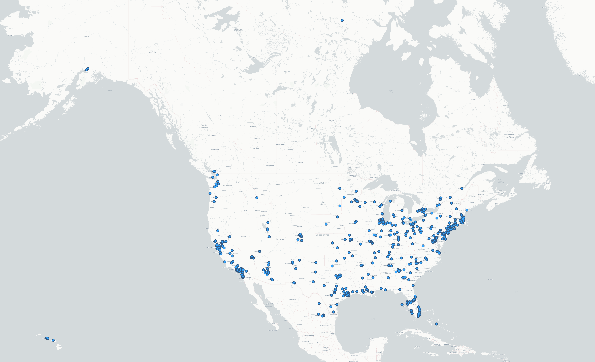

# Geo-tagged tweet collection and visualization
In this practical exercise, I collected Geo-tagged Twitter data using an API-based crawler and visualize them on a map using a mapping tool QGIS. In the map below, it tracked the Twitter posts which contained the keyword `quarantine`. I used `stream.filter(track=['quarantine'], is_async=True)` to filter tweets through a keyword. 

In this map, instead of showing the world map as a whole, I zoomed in to my target geographical area, which is the United States. We can see geocoded locations where tweets were made, and distribution of the tweets tells us in which geographic areas Twitter is most frequently used. According to the map, it seems like Twitter users who're living in metropolitan areas are more likely to tweet posts about their quarantine life. The density of the data points in areas like New York City, Los Angeles, Miami, etc. are relatively higher than in other places. 
